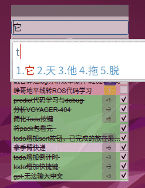
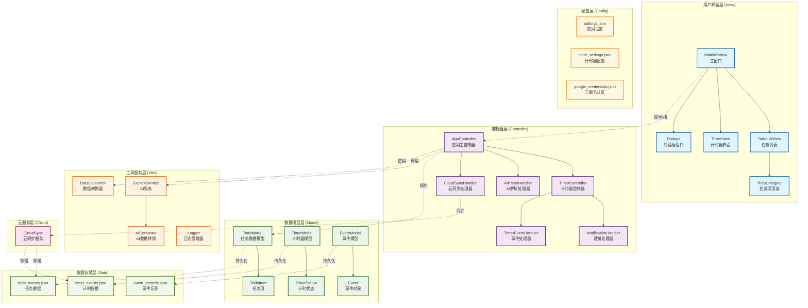

# Todoer - 智能待办事项管理应用

[](https://python.org)
[](https://pyside.org)
[](LICENSE)

一个功能丰富的待办事项管理应用，集成了AI智能解析、番茄钟计时器、云同步等现代功能，基于PySide6构建的跨平台桌面应用。

## ✨ 功能演示



## 🚀 核心功能

### 📝 智能任务管理
- **添加任务**: 在输入框中输入任务内容，按回车键快速添加
- **AI智能解析**: 使用 `Shift+Enter` 激活AI解析，自动识别优先级、类别和截止日期
- **编辑任务**: 双击任务或右键编辑，支持修改所有属性
- **删除任务**: 右键删除或使用快捷键，带确认对话框
- **任务状态**: 复选框切换完成状态，完成任务显示删除线

### 🍅 番茄钟计时器
- **专注计时**: 集成番茄钟技术，帮助专注工作
- **系统通知**: 跨平台通知系统，支持声音提醒
- **事件记录**: 计时结束后记录完成的事件和分类
- **云同步**: 计时数据支持云端同步，多设备共享

### 🤖 AI智能功能
- **自然语言解析**: 使用Google Gemini AI智能解析任务描述
- **自动分类**: 智能识别任务类别（工作、生活、学习等）
- **优先级判断**: 根据内容自动判断任务优先级
- **时间提取**: 从自然语言中提取截止日期信息

### ☁️ 云端同步
- **数据备份**: 自动备份任务和计时数据到Google Cloud Storage
- **多设备同步**: 在不同设备间同步数据，保持一致性
- **离线支持**: 离线模式下正常使用，联网后自动同步

### 🎨 用户界面
- **现代设计**: 简洁美观的Material Design风格界面
- **深色主题**: 支持深色/浅色主题切换
- **响应式布局**: 自适应窗口大小，优化显示效果
- **快捷键支持**: 丰富的快捷键操作，提高使用效率

## 🏗️ 项目架构

### 架构图



### 设计模式

- **MVC架构**: 清晰的模型-视图-控制器分离
- **观察者模式**: 基于Qt信号槽机制的事件驱动
- **策略模式**: 多种解析策略（AI解析 vs 传统解析）
- **单例模式**: 全局服务和配置管理
- **工厂模式**: 动态创建不同类型的处理器

## 📦 模块说明

### 📁 [controller/](controller/README.md)
应用程序的控制器层，协调模型和视图之间的交互，处理用户操作和业务流程。

### 📁 [model/](model/README.md)  
数据模型层，管理应用程序的核心数据和业务逻辑，实现数据持久化。

### 📁 [view/](view/README.md)
用户界面层，包含所有的UI组件、窗口、对话框和自定义控件。

### 📁 [utils/](utils/README.md)
工具服务层，提供AI解析、数据转换、日志管理等基础服务。

### 📁 [cloud/](cloud/README.md)
云同步服务，实现与Google Cloud Storage的数据同步功能。

### 📁 [config/](config/README.md)
配置管理，存储应用设置、云服务认证和各种功能参数。

### 📁 [data/](data/README.md)
本地数据存储，管理待办事项、计时记录等持久化数据文件。

### 📁 [doc/](doc/README.md)
项目文档，包含演示动画、截图和使用说明等资源。

### 📁 [logs/](logs/README.md)
日志系统，按模块分类记录应用运行状态、错误信息和用户操作。

## 🛠️ 技术栈

- **UI框架**: PySide6 (Qt6)
- **AI服务**: Google Generative AI (Gemini)
- **云存储**: Google Cloud Storage
- **数据验证**: Pydantic
- **日志管理**: Python logging
- **数据格式**: JSON
- **开发语言**: Python 3.8+

## 📋 安装依赖

```bash
pip install -r requirements.txt
```

## ⚙️ 配置

### 环境变量
```bash
# AI服务配置
export GEMINI_API_KEY="your_gemini_api_key"

# Google Cloud配置 (可选)
export GOOGLE_APPLICATION_CREDENTIALS="config/your_credentials.json"
```

### 配置文件
- `config/settings.json`: 应用主要设置
- `config/timer_settings.json`: 番茄钟配置
- `config/google_credentials.json`: 云服务认证 (敏感文件)

## 🚀 运行应用

```bash
python main.py
```

## ⌨️ 快捷键

- `Enter`: 添加任务 (传统解析)
- `Shift+Enter`: 添加任务 (AI解析)
- `Ctrl+S`: 保存任务列表
- `Ctrl+L`: 加载任务列表  
- `Ctrl+R`: 排序任务列表
- `Alt+T`: 显示/隐藏窗口
- `Del`: 删除选中任务

## 🔧 开发

### 代码规范
- 遵循Google Python代码风格
- 单个文件不超过200行
- 每个函数不超过30行
- 使用中文注释和文档

### 测试
```bash
# 运行单元测试
python -m pytest tests/

# 运行特定模块测试
python -m pytest tests/test_model.py
```

## 📝 更新日志

查看 [CHANGELOG.md] 获取详细的版本更新信息。

## 📄 许可证

本项目采用 MIT 许可证 - 查看 [LICENSE](LICENSE) 文件了解详情。

## 🤝 贡献

欢迎提交 Pull Request 和 Issue！请阅读贡献指南了解更多信息。

## 📧 联系

如有问题或建议，请通过 Issue 或邮件联系。
